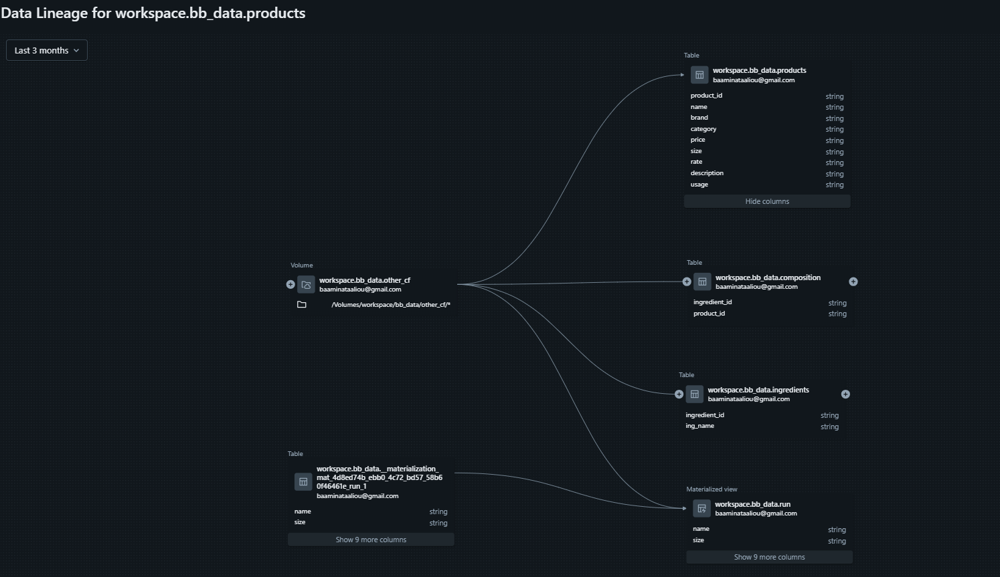
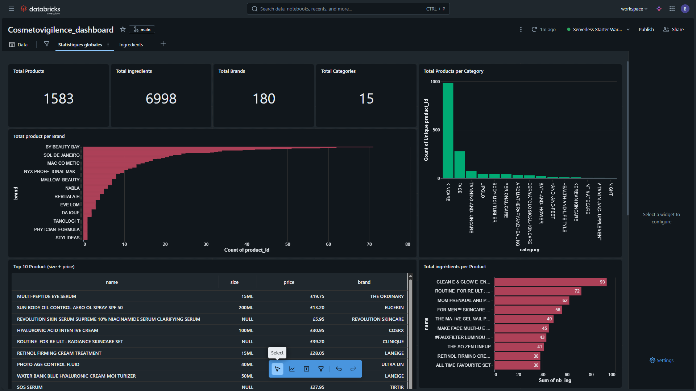

# Pipeline PySpark pour la normalisation des produits cosmétiques – Databricks (ETL + Visualisation)

## Description

- ingestion CSV
- nettoyage
- normalisation
- extraction ingrédients
- construction des 3 tables
- UUID
- Delta Lake

# Techniques utilisées

- Databricks
- PySpark
- Delta Lake
- Spark SQL
- Régex Python
- Pipelines de transformation
- Dashboard Databricks

# Architecture

Ajoute un petit schéma simple (flux → transformation → tables Delta → Dashboard)

# Objectif du pipeline

Créer un modèle produit / ingrédient exploitable et des KPI via un dashboard

# Dashboard interactif
